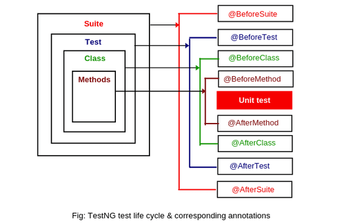

## Test NG Structure
* Suite: A suite is made of one or more tests.
* Test: A test is made of one or more classes.
* Class: A class is made of one or more methods.

### Test Hierarchy

### Lifecycle

## Best Practices
